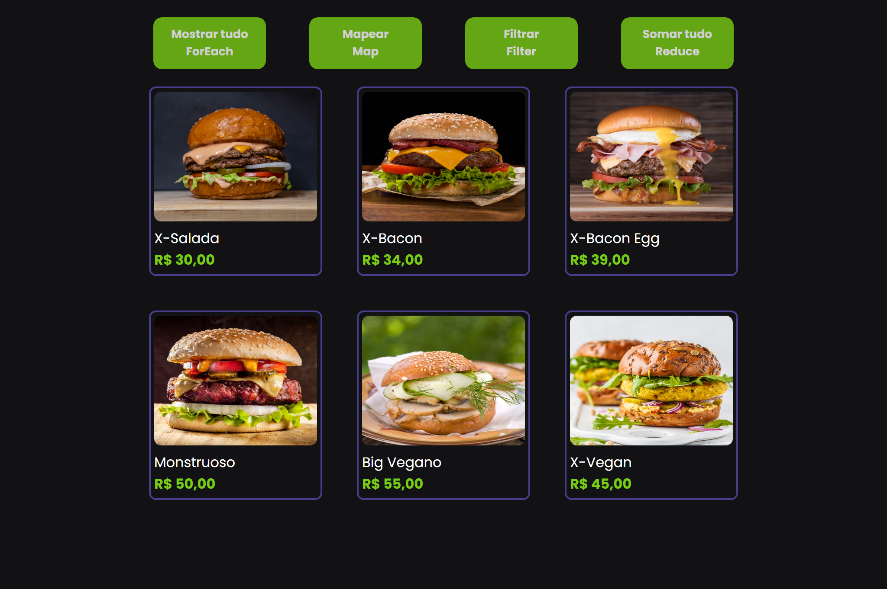

# Burger Menu

Este é um projeto simples de uma página web que mostra um menu de burgers utilizando HTML, CSS e JavaScript. A página permite que os usuários visualizem todos os itens do menu, apliquem descontos, filtrem itens veganos e somem o preço total dos itens do menu.

## Índice

- [Projeto Online](#projeto-online)
- [Instalação](#instalação)
- [Uso](#uso)
- [Funcionalidades](#funcionalidades)
- [Tecnologias Utilizadas](#tecnologias-utilizadas)

## Projeto Online

<a href="https://barbaraishioka.github.io/javascript/desafios/modulo4/burger-menu/"></a>

## Instalação

1. Clone o repositório:

   ```bash
   git clone https://github.com/barbaraishioka/javascript.git
   ```

2. Navegue até o diretório do projeto:

   ```bash
   cd javascript/desafios/modulo4/burger-menu/
   ```

3. Abra o arquivo `index.html` no seu navegador preferido.

## Uso

Na página principal, você verá quatro botões:

- **Mostrar tudo:** Mostra todos os itens do menu.
- **Mapear:** Aplica um desconto de 10% em todos os itens do menu.
- **Filtrar:** Filtra e mostra apenas os itens veganos.
- **Somar tudo:** Calcula e mostra o valor total dos itens do menu sem desconto.

Clique nos botões para executar as diferentes funcionalidades e ver os resultados na lista de produtos.

## Funcionalidades

- **Mostrar tudo:** Utiliza o método `forEach` para listar todos os produtos.
- **Mapear:** Utiliza o método `map` para aplicar um desconto de 10% nos preços dos produtos.
- **Filtrar:** Utiliza o método `filter` para listar apenas os produtos veganos.
- **Somar tudo:** Utiliza o método `reduce` para calcular a soma dos preços dos produtos.

## Tecnologias Utilizadas

- HTML
- CSS
- JavaScript

## Licença

Este projeto está licenciado sob a licença MIT.
